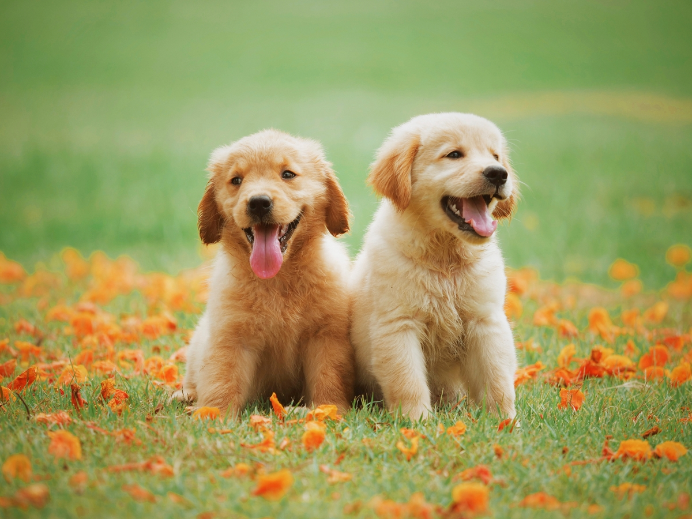
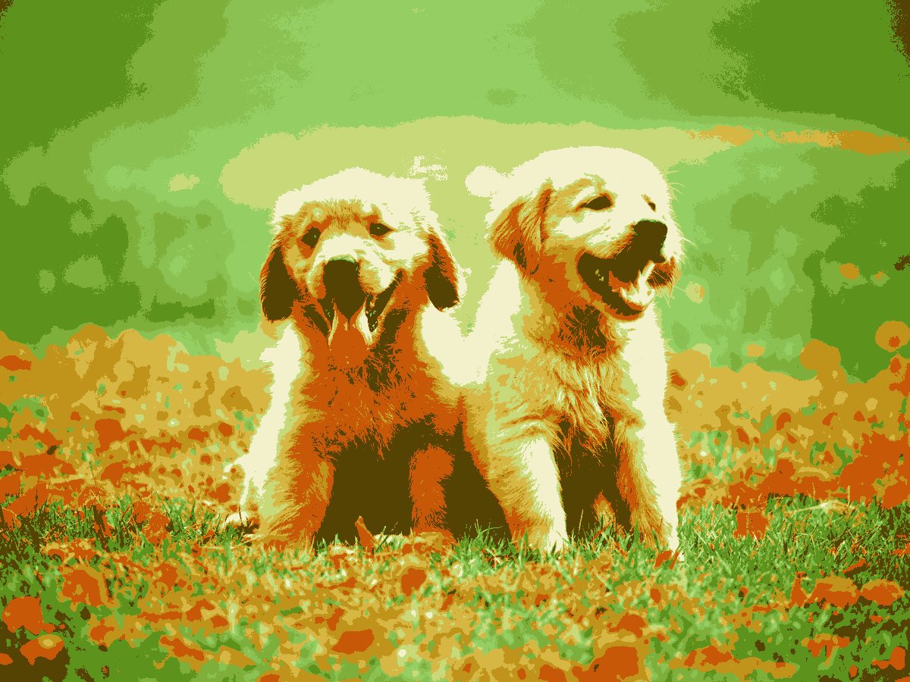
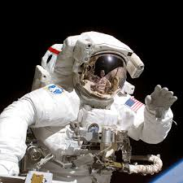

# 🖼️ Simple Image Posterizer in Python

This is a small Python project that takes an input image and reduces the number of colors while optionally applying a custom color tint and adjustable contrast. The goal was simple — to experiment with posterization, color quantization, and basic image manipulation using **Pillow** and **NumPy**.  

This was never meant to be a large-scale image editor or professional tool — just a fun, educational script to play around with image processing. However, it can still give some surprisingly aesthetic results with the right parameters.

---

## ⚠️ Disclaimer

Before using this script:
- There’s **no GUI**, only a **CLI**.
- **Performance** depends on image size and process mode — larger images and custom tint will take longer to process. Some files can take upto a minute
- There’s **no input validation**, so incorrect values might cause errors or crashes.
- The project will **not be actively developed further**, but the repository will remain open for anyone who wants to experiment, fork, or modify it.

---

## 🧠 Introduction

**Simple Image Posterizer** is a standalone Python script that lets you:
- Limit an image to a fixed number of colors.
- Optionally apply a **custom tint** (with RGB values you define).
- Adjust the **contrast** for a more stylized look.

It’s written entirely in Python using the **Pillow** and **NumPy** libraries, both of which are required to run the script.

---

## 📦 Installation

### Requirements

You’ll need:
- Python 3.8 or higher  
- Pillow (`pip install pillow`)  
- NumPy (`pip install numpy`)  

### How to run

1. Clone or download this repository.  
2. Open a terminal or command prompt inside the project folder.  
3. Run the script:

   ```bash
   python image-filter.py

---

## 🧪 Examples

### 🖼️ Input


### 🎨 Output


### ⚙️ Parameters Used
```bash
enter the no. of colors you want: 10
enter the amount of contrast you want, 1.5 is suggested: 1.7
enter 1 for default mode and 2 for custom color mode: 1
```

---

### 🖼️ Input


### 🎨 Output


### ⚙️ Parameters Used
```bash
enter the no. of colors you want: 6
enter the amount of contrast you want, 1.5 is suggested: 1.5
enter 1 for default mode and 2 for custom color mode: 2

Enter your custom tint color (RGB values 0-255):
Red (0-255): 122
Green (0-255): 0
Blue (0-255): 153
```

---

### 🖼️ Input


### 🎨 Output


### ⚙️ Parameters Used
```bash
enter the no. of colors you want: 6
enter the amount of contrast you want, 1.5 is suggested: 1.5
enter 1 for default mode and 2 for custom color mode: 2

Enter your custom tint color (RGB values 0-255):
Red (0-255): 255           
Green (0-255): 26          
Blue (0-255): 102          
